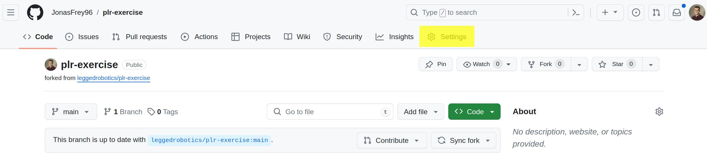
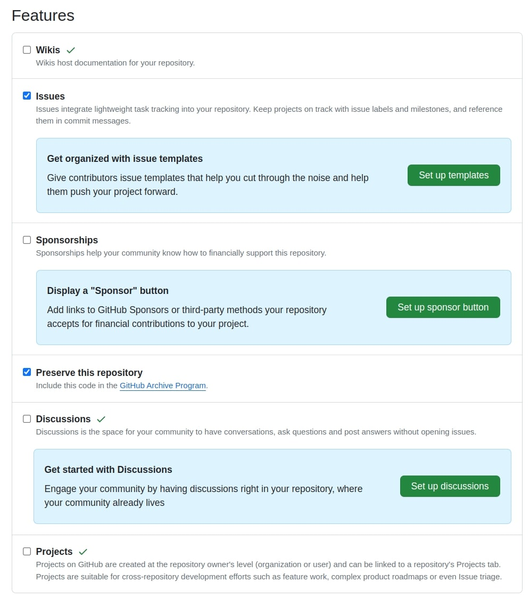

# Best Practices for your ML-Project

## Setting up a virtual environment
[https://packaging.python.org/en/latest/guides/section-install/](https://packaging.python.org/en/latest/guides/section-install/)


Create folder to store virtual environments:
```shell
mkdir ~/venv
```

Create the virtual environment:
```shell
python3 -m venv ~/venv/plr
```

Test the virtual environment
```shell
source ~/venv/plr/bin/activate
which python
```

Add alias to .bashrc or .zshrc to easier source venv.
```shell
code ~/.bashrc

# Append the following and save file

alias venv_plr="source ~/venv/plr/bin/activate"
```

## Transforming scrips into a software project
Create a fork of the project on GitHub
```shell
cd ~/git
git clone git@github.com:leggedrobotics/plr-exercise.git
```

Replace `leggedrobotics` with your `username`.

Small notice you can clone a repo using ssh or https. 
I recommend to setup ssh-keys and always use ssh. 

Then go to the Github Settings to right:  



Activate under General the following Features:  


### Submission instructions
You at first create a fork of the plr-exercise repository under your local GitHub username.  
For each task you create a branch called: `dev/task_X`  
You commit all the changes necessary for this task to this branch and push the changes to GitHub.  
To finish a task, you create a pull request from `dev/task_X` to `main`. 
The title of the pull request is the task description below.  
Do not delete the branches after merging the PR.  

Task Descriptions:
- **Task 0:** Run train.py and create an issue and complain about your low test score.
- **Task 1:** Improve the formatting using black
- **Task 2:** Create a python package for your project
- **Task 3:** Add an online logging framework
- **Task 4:** Use optuna to perform a hyperparameter search
- **Task 5:** Add docstrings to every file.

### Overview
You are given the `train.py` script.
Try to run the script: 

```shell
python3 train.py
```

The final test result will be printed to the command line:
```shell
Test set: Average loss: X.XXXX, Accuracy: XXXX/10000 (XX%)
```
Create an issue on GitHub complaining about the low test result.

While the file is very simple it has some problems with the formatting and also does not scale to a larger project. 


🚀🚀🚀 Let's improve this together! 🚀🚀🚀


### Task 1
Your first task is to install `black` and format the code. 
Take a look here: [https://github.com/psf/black](https://github.com/psf/black)

```shell
pip3 install black
black --line-length 120 ~/git/plr-exercise
```
Now everything looks pretty.


### Task 2
You have to correctly create a `setup.py`
Then you can install the package as follows:

```
cd ~/git/plr-exercise
pip3 install -e ./
```

We would like the repository structure to look as follows:

```yaml
project_name:
├──results: 
│    ├──YEAR_MONTH_DAY_TIME_experiment_name:
│        ├──results.yml 
│        └──....
│
├──project_name:
│    ├──models:
│    |   ├──cnn.py
│    |   └──__init__.py
│    └──__init__.py   
│        
├──scripts:
│    ├──train.py
│    └──timeing.py 
│
├──setup.py
├──.gitignore
├──README.md
```

However, we do not want to commit the files within the results folder.  
Create a `.gitignore` file and add all the files within the results to be ignored.

### Task 3
Add wandb logger.

```shell
pip3 install wandb
```
Follow the quickstart guide here: [https://docs.wandb.ai/quickstart](https://docs.wandb.ai/quickstart)  
Log the training_loss, test_loss, and your code as an artificat.  
Create a PR with a screenshot of a run with the loss curve and the uploaded source code artifact.  


### Task 4
Use optuna to find the best learning rate and epoch.

```shell
pip3 install optuna
```

This may be a good starting point [https://optuna.org/#code_examples](https://optuna.org/#code_examples)

```python
import optuna

def objective(trial):
    x = trial.suggest_float('x', -10, 10)
    return (x - 2) ** 2

study = optuna.create_study()
study.optimize(objective, n_trials=100)

study.best_params  # E.g. {'x': 2.002108042}
```

### Task 5 
Add docstrings to all classes and functions: [https://peps.python.org/pep-0257/](https://peps.python.org/pep-0257/)  
Here are some workflows by the RSL that may help you: [https://github.com/leggedrobotics/workflows](https://github.com/leggedrobotics/workflows)


## Things we did not cover
- Timing - check out the `timing.py` and try to understand why the times are different 
- Typing
- GitHub Actions

## Bonus points

You can get bonus points if you improve this version of this README by fixing errors or adding other useful "tasks" below that you think will help others.
This may include: 
- Improved Reproducibility
- Visualization
- Configuration with Hydra, OmegaConfiguration
- Measuring the time

## Other useful tasks [Bonus Points]
